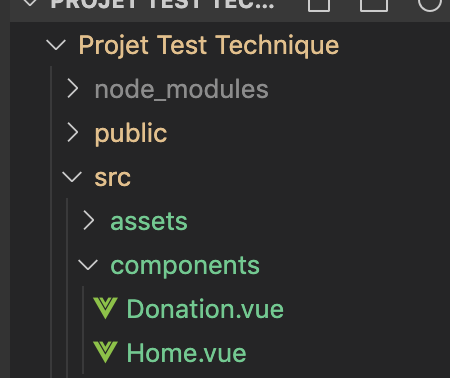
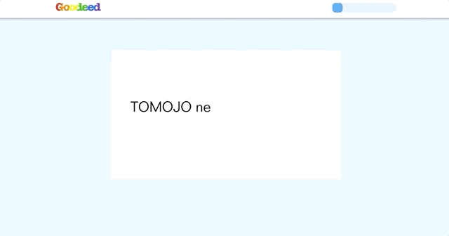
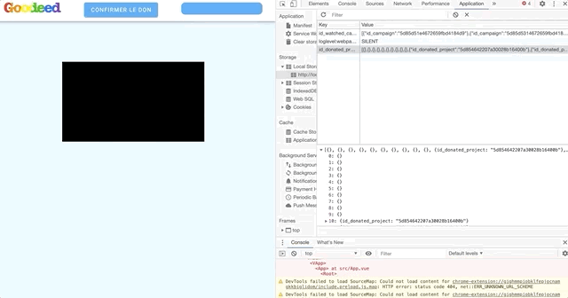
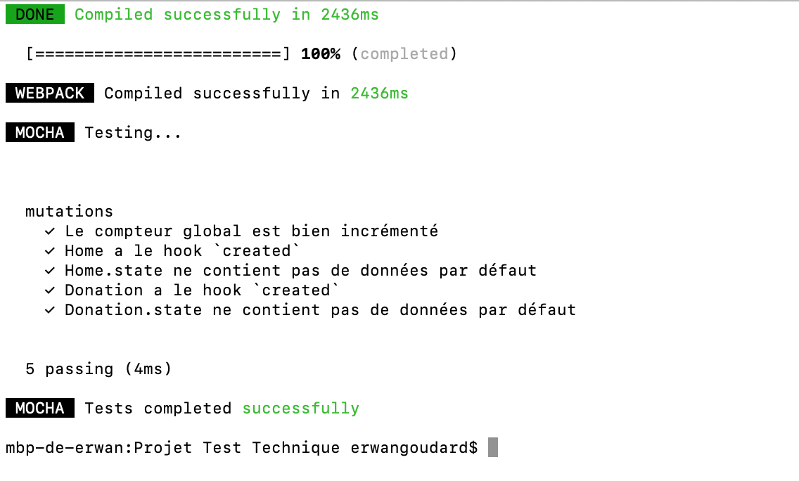

# Test Technique Erwan

Voici l'App que j'ai réalisée dans le cadre du test technique que vous m'avez proposé.

Technologies utilisées: Vue.js, Webpack, Vuetify, Vuex, Es6, Local Storage.

## Project Setup

```bash
npm install
```

Si des vulnérabilités sont détéctées:

```bash
npm audit fix
```
## Compilation et auto-chargement en développement
```bash
npm run serve
```

## Compilation pour production
```bash
npm run build
```

## Rendu et architecture

J'ai choisi de structurer l'App le plus simplement possible avec un fichier principal, App.vue, qui permet d'afficher les composants. Il y a deux composants, le premier nommé Home.vue est la page contenant les projets et le deuxième appelé Donation.vue est la page qui s'ouvre une fois que l'utilisateur a cliqué sur "Donner Gratuitement" et qui va afficher la vidéo et le compteur de 20secondes.




Home est une page dynamique qui va chercher les projets dans le fichier projectData.js et les dispose sous formes de cartes en récupérant les photos, titre, description et autres informations. En bas de chaque carte un bouton permet de passer à la page suivant en cliquant. En cliquant sur le bouton, l'id du projet en question est directement ajouté au local storage afin d'enregistrer le don.

 


Donation s'ouvre lorsqu'on clique sur Donner Gratuitement. Une vidéo publicitaire est alors choisie aléatoirement parmi les campagnes du fichier adCampaignData et jouée. Une barre de chargement en haut à droite nous indique où nous en sommes dans les 20secondes de visionnage nécessaires au don.

 

Après les 20 secondes, un bouton Confirmer apparait entre le logo et la barre, il permet de retourner à la page des projets et d'actualiser le compteur de dons global et le compteur du projet auquel on a donné. Le clic envoie aussi l'id de la campagne visionnée dans le local storage.

 

## Bonus

> Comment s’assurer que l’utilisateur est bien resté 20 secondes sur l’expérience de
publicité ?


1) Point de vue Technique

On peut utiliser le code suivant afin d'afficher une alerte lorsque l'utilisateur souhaite cliquer sur précédent afin de bloquer temporairement la redirection et de l'encourager à rester sur la page:

```bash
<script language="javascript" type="text/javascript">
window.onbeforeunload = function()
{
    return "Are you sure want to leave the page?";
}
</script>
```
Je pense qu'il est aussi important de couper la lecture de la publicité lorsque l'utilisateur change de page, afin de l'encourager à revenir dessus pour finir les 20 secondes de visionnage. On peut le faire en utilisant jQuery par exemple:

```bash
$(document).on('show.visibility', function() {
    $('#myvideo').get(0).play();
});
$(document).on('hide.visibility', function() {
    $('#myvideo').get(0).pause();
});).
```


2) Point de vue Produit


On peut utiliser un outil d'Ad Tracking comme Google Ads, IAS ou MOAT qui permet d'obtenir des métriques d'analyse comme le 'average watch time per impression'. Si jamais on voit que les personnes ont tendance à quitter le site avant la fin des 20 secondes, je pense qu'il faut faire des tests sur la page sur laquelle joue la vidéo pour améliorer le temps moyen de visionnage. 

A mon avis dans ce cas il faut rassurer l'utilisateur sur le fait que ce ne sont que 20secondes. Donc afficher un décompte est une bonne idée, plutôt de 20 à 0 que dans l'autre sens à mon avis car il y a un effet psychologique agréable à voir le temps diminuer et non augmenter. 

On peut aussi faire du A/B testing en faisant une version avec une rapide phrase d'explication bien catchy ou même une petite section à côté de la pub pour préciser qu'en donnant 20 petites secondes de son temps, l'utilisateur permet de... -> insérer les informations propres au projet pour rappeler à l'utilisateur pourquoi il a voulu donner et le motiver à patienter.

La phrase d'explication peut inclure le décompte: 'Bravo, votre don pour ... sera effectif dans [inclure le décompte ici qui défile en direct]secondes'.

Une autre idée serait d'inclure un très rapide questionnaire au moment de l'inscription afin de s'informer sur les principaux intérêts de l'utilisateur (ex: cocher 3 choix parmi musique, sports, tech, voyages) et de filtrer les campagnes que l'on va afficher en fonctions des intérêts utilisateur. 


> Réaliser des tests

J'ai utilisé Mocha pour tester cetains des composants. Les tests sont écrits dans le fichier mutations.spec.js.

Je teste ici si le compteur global est bien incrémenté et donc si la mutation fonctionne correctement, je teste si Home et Donation ont bien le hook Created et si leur state ne contient pas de données par défaut. 

Pour lancer les tests: 

```bash
npm run test:unit
```
 
